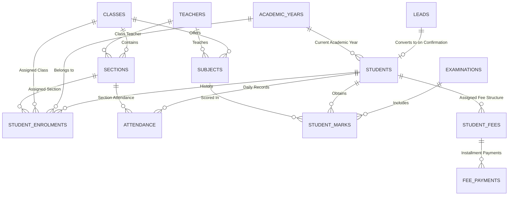

# Database Architecture & Data Relationships Specification

## 1. Overview
This document specifies the complete data model, module schemas, fields, data types, and inter-module relationships for the **School Management System** built on **Zoho CRM** and **Zoho Creator**.

The architecture follows strict relational normalization principles while utilizing Zoho CRM's Custom Modules, Lookup fields, Many-to-Many junction objects, and Zoho Creator's form lookup mechanisms.

---

## 2. Entity Relationship Diagram (ERD)



---

## 3. Zoho CRM Module Schemas & Field Definitions

### 3.1. Leads (Admissions Enquiries)
*Module API Name: `Leads`*

| Field Label | API Name | Field Type | Validation / Properties | Description |
| :--- | :--- | :--- | :--- | :--- |
| First Name | `First_Name` | Single Line | Required | Student applicant's first name |
| Last Name | `Last_Name` | Single Line | Required | Student applicant's last name |
| Parent Name | `Parent_Name` | Single Line | Required | Guardian / Parent full name |
| Parent Email | `Email` | Email | Unique, Required | Primary email used for Creator login |
| Parent Phone | `Phone` | Phone | Required | Primary phone contact |
| Date of Birth | `Date_of_Birth` | Date | Past Date | Student date of birth |
| Grade Applied | `Grade_Applied` | Picklist | Grade 1..12 | Target class for admission |
| Enquiry Date | `Enquiry_Date` | Date | Default = Today | Date enquiry submitted via webform |
| Admission Status| `Admission_Status`| Picklist | `Enquiry Received`, `Document Verification`, `Interview Scheduled`, `Confirmed`, `Rejected` | Pipeline status |
| Rejection Reason | `Rejection_Reason`| Multi-line Text | Conditional | Reason if rejected |

---

### 3.2. Students
*Module API Name: `Students` (Custom Module)*

| Field Label | API Name | Field Type | Validation / Properties | Description |
| :--- | :--- | :--- | :--- | :--- |
| Student Name | `Name` | Single Line | Auto-populated | Full Name of student |
| Student ID | `Student_ID` | Single Line | Auto-generated (`STU-YYYY-XXXX`), Unique, Read-only | Unique identifier |
| Parent Name | `Parent_Name` | Single Line | Required | Parent/Guardian name |
| Parent Email | `Parent_Email` | Email | Required, Indexed | Link key for Zoho Creator parent portal |
| Parent Phone | `Parent_Phone` | Phone | Required | Parent contact phone |
| Current Academic Year | `Academic_Year` | Lookup (`Academic_Years`) | Required | Active academic year |
| Current Class | `Class` | Lookup (`Classes`) | Required | Active class grade |
| Current Section | `Section` | Lookup (`Sections`) | Required | Active section |
| Date of Birth | `Date_of_Birth` | Date | Required | DOB |
| Gender | `Gender` | Picklist | `Male`, `Female`, `Other` | Gender |
| Enrollment Date | `Enrollment_Date` | Date | Auto-set on conversion | Date admitted |
| Status | `Student_Status` | Picklist | `Active`, `Graduated`, `Withdrawn`, `Suspended` | Current status |
| Attendance % | `Attendance_Percentage` | Percent | Auto-calculated via Deluge | Rollup attendance percentage |
| Academic Grade | `Overall_Grade` | Picklist | `A+`, `A`, `B`, `C`, `F` | Auto-computed overall grade |
| Fee Status | `Fee_Status` | Picklist | `Paid`, `Partial`, `Overdue`, `Pending` | Rollup fee status |

---

### 3.3. Academic Structure Modules

#### A. Academic Years (`Academic_Years`)
- `Name`: e.g. `2025-2026` (Single Line, Primary Name)
- `Start_Date`: Date (Required)
- `End_Date`: Date (Required)
- `Is_Current`: Boolean (Checkbox - active year indicator)

#### B. Classes (`Classes`)
- `Name`: e.g. `Grade 10` (Single Line, Primary Name)
- `Code`: Single Line (e.g. `G10`)
- `Description`: Multi-line Text

#### C. Sections (`Sections`)
- `Name`: e.g. `Section A` (Single Line)
- `Class`: Lookup to `Classes` (Required)
- `Class_Teacher`: Lookup to `Teachers`
- `Capacity`: Integer (Max students allowed)

#### D. Subjects (`Subjects`)
- `Name`: e.g. `Mathematics` (Single Line)
- `Code`: Single Line (e.g. `MATH-10`)
- `Class`: Lookup to `Classes` (Required)
- `Teacher`: Lookup to `Teachers`

#### E. Teachers (`Teachers`)
- `Name`: Teacher Full Name (Single Line)
- `Teacher_ID`: Unique ID (`TCH-XXXX`)
- `Email`: Email (Required)
- `Phone`: Phone
- `Qualification`: Single Line

---

### 3.4. Attendance Records (`Attendance`)
*Module API Name: `Attendance`*

| Field Label | API Name | Field Type | Description |
| :--- | :--- | :--- | :--- |
| Attendance Name | `Name` | Single Line | Auto-generated format: `[Student_ID] - [Date]` |
| Student | `Student` | Lookup (`Students`) | Required |
| Attendance Date | `Attendance_Date` | Date | Required |
| Status | `Status` | Picklist | `Present`, `Absent`, `Late`, `Excused` |
| Class & Section | `Section` | Lookup (`Sections`) | Section where attendance was marked |
| Marked By | `Teacher` | Lookup (`Teachers`) | Staff member recording attendance |
| Unique Key | `Attendance_Key` | Single Line | `Student_ID_YYYYMMDD` (Enforces duplicate prevention) |

---

### 3.5. Examinations & Marks

#### A. Examinations (`Examinations`)
- `Name`: e.g. `Mid-Term Examination 2026`
- `Academic_Year`: Lookup to `Academic_Years`
- `Term`: Picklist (`Term 1`, `Term 2`, `Final`)
- `Start_Date`: Date
- `End_Date`: Date

#### B. Student Marks (`Student_Marks`)
- `Name`: Auto-format `[Student_ID] - [Subject] - [Exam]`
- `Student`: Lookup to `Students` (Required)
- `Examination`: Lookup to `Examinations` (Required)
- `Subject`: Lookup to `Subjects` (Required)
- `Marks_Obtained`: Decimal (Required)
- `Max_Marks`: Decimal (Default = 100)
- `Percentage`: Percent (Calculated via Deluge)
- `Grade`: Picklist (`A+`, `A`, `B`, `C`, `F`) (Calculated via Deluge)
- `Result_Status`: Picklist (`Pass`, `Fail`) (Calculated via Deluge: Pass if >= 40%)

---

### 3.6. Fee & Payment Management

#### A. Student Fee Structure (`Student_Fees`)
- `Name`: e.g. `Annual Fee 2026 - STU-2026-0001`
- `Student`: Lookup to `Students` (Required)
- `Academic_Year`: Lookup to `Academic_Years`
- `Total_Fee_Amount`: Currency (Required)
- `Amount_Collected`: Currency (Calculated via Deluge Rollup)
- `Outstanding_Balance`: Currency (Calculated: `Total_Fee_Amount - Amount_Collected`)
- `Fee_Status`: Picklist (`Paid`, `Partial`, `Overdue`)
- `Due_Date`: Date

#### B. Fee Payments (`Fee_Payments`)
- `Name`: Receipt Number e.g. `REC-2026-0089`
- `Student_Fee`: Lookup to `Student_Fees` (Required)
- `Student`: Lookup to `Students` (Required)
- `Payment_Date`: Date (Required)
- `Amount_Paid`: Currency (Required)
- `Payment_Method`: Picklist (`Bank Transfer`, `Credit Card`, `UPI`, `Cash`, `Cheque`)
- `Transaction_ID`: Single Line
- `Installment_Number`: Integer (`1`, `2`, `3`, etc.)

---

## 4. Zoho Creator Architecture (Parent App)

### 4.1. Forms & Components
1. **My Students Form**: Read-only view synced from CRM `Students` module.
2. **Attendance History View**: Filtered grid showing daily status, present count, absent count, and percentage bar.
3. **Report Card / Exam View**: Grade sheets categorized by Exam Term and Subject.
4. **Fee & Payment History Portal**: Breakdown of total fee, paid installments, balance due, and online payment upload/acknowledgment form.

### 4.2. Access Security & Data Isolation
- Zoho Creator uses **Row-Level Criteria**:
  ```deluge
  Parent_Email == zoho.loginuserid
  ```
- Parents can only see student records where the `Parent_Email` on the student profile matches their authenticated login email.

---

## 5. Automation Summary
1. **Lead Conversion**: Automatically generates `Student_ID`, converts Lead to Student, initializes Fee structure upon marking `Admission_Status = 'Confirmed'`.
2. **Attendance Duplicate Check**: Validates `Attendance_Key` before insert and updates `Attendance_Percentage` on `Students` record.
3. **Grade Calculator**: Validates `Marks_Obtained <= Max_Marks`, calculates `%`, assigns `Grade` & `Result_Status`.
4. **Fee Balance Calculation**: Computes `Amount_Collected` and `Outstanding_Balance` after every `Fee_Payments` insert/update.
5. **CRM-Creator Realtime Sync**: Executes `zoho.creator.createRecord` / `zoho.creator.updateRecord` on CRM updates.
